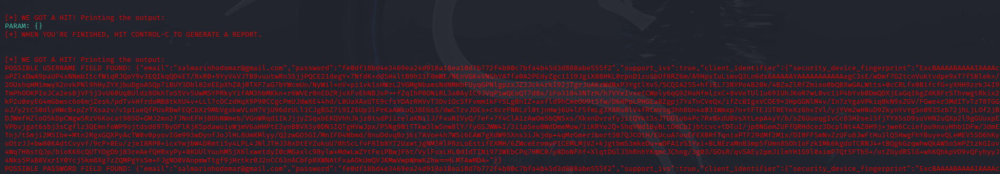

# Phishing para captura de senhas da Shopee

### Ferramentas

- Kali Linux
- setoolkit

### Configurando o Phishing no Kali Linux

- Acesso root: ``` sudo su ```
- Iniciando o setoolkit: ``` setoolkit ```
- Tipo de ataque: ``` Social-Engineering Attacks ```
- Vetor de ataque: ``` Web Site Attack Vectors ```
- Método de ataque: ```Credential Harvester Attack Method ```
- Método de ataque: ``` Site Cloner ```
- Obtendo o endereço da máquina: ``` ifconfig ```
- Confimar o IP da máquina para ser o servidor
- URL para clone: https://shopee.com.br/buyer/login?gad_source=1&gclid=EAIaIQobChMIsp2x24CXiwMVrRFECB27IC0MEAAYASAAEgJSl_D_BwE&next=https%3A%2F%2Fshopee.com.br%2F%3Fgad_source%3D1%26gclid%3DEAIaIQobChMIsp2x24CXiwMVrRFECB27IC0MEAAYASAAEgJSl_D_BwE

### Resutados


